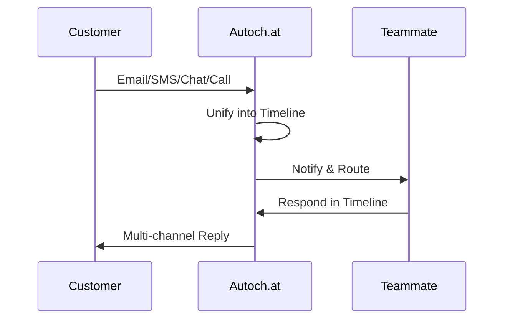

## Overview

Autoch.at provides a unified platform for managing customer conversations across email, SMS, website chat, and voice calls. You access all messages in one shared timeline, eliminating fragmentation and ensuring context persists across channels. Key features include AI-powered drafting and summarization, intelligent routing, standardized playbooks, and analytics to track outcomes.

<Callout kind="info">
Enable these features in your dashboard at `https://dashboard.example.com/settings` to start unifying your conversations.
</Callout>

## Key Features at a Glance

<Columns cols={3}>
  <Card title="Unified Timeline" icon="message-circle" href="#unified-timeline">
    View every interaction in a single, chronological record across all channels.
  </Card>
  <Card title="AI Assistants" icon="zap" href="#ai-assistants">
    Automate drafts, summaries, and routing with customizable guardrails.
  </Card>
  <Card title="Routing & Handoffs" icon="git-branch" href="#routing">
    Direct conversations to the right team member based on rules you define.
  </Card>
  <Card title="Playbooks" icon="book-open" href="#playbooks">
    Standardize responses with versioned templates you can audit.
  </Card>
  <Card title="Analytics" icon="bar-chart-3" href="#analytics">
    Measure conversation success and identify areas for improvement.
  </Card>
</Columns>

## Unified Conversation Timeline

Combine messages from multiple channels into one cohesive view. You see emails, SMS, chats, and call notes in sequence, with clear ownership and status indicators.

### How It Works

<Steps>
  <Step title="Connect Channels" icon="plug">
    Link your email, SMS provider, chat widget, and telephony service in the dashboard.
  </Step>
  <Step title="View Timeline" icon="timeline">
    Open any conversation to see the full history, tagged by channel.
  </Step>
  <Step title="Assign Ownership" icon="user-check">
    Tag teammates and set next steps directly in the timeline.
  </Step>
</Steps>



## AI Drafting and Summarization

AI assistants draft replies, summarize long threads, and suggest escalations while respecting your business rules.

<Tabs>
  <Tab title="Drafting" icon="edit-3">
    Configure AI to generate responses based on playbook templates.

    <CodeGroup tabs="JavaScript,cURL">
    ````javascript
    const response = await fetch('https://api.example.com/v1/conversations/{conversationId}/draft', {
      method: 'POST',
      headers: { 'Authorization': 'Bearer YOUR_API_KEY' },
      body: JSON.stringify({ prompt: 'Suggest polite follow-up' })
    });
    ````
    ````bash
    curl -X POST https://api.example.com/v1/conversations/{conversationId}/draft \
      -H "Authorization: Bearer YOUR_API_KEY" \
      -d '{"prompt": "Suggest polite follow-up"}'
    ````
    </CodeGroup>
  </Tab>
  <Tab title="Summarization" icon="file-text">
    Get concise overviews of conversation history.

    <Callout kind="tip">
      Use summaries to quickly catch up on assigned conversations.
    </Callout>
  </Tab>
</Tabs>

<ParamField path="conversationId" param-type="string" required="true">
  Unique ID from the conversation timeline.
</ParamField>

<ParamField query="model" param-type="string" required="false">
  AI model variant, e.g., `quiet-ai-standard`.
</ParamField>

## Routing and Handoff Mechanisms

Route incoming messages by channel, keywords, or intent. Hand off seamlessly between teammates with context preserved.

<Expandable title="Advanced Routing Rules" default-open="false">
  Define rules like:

  | Rule Type   | Example Trigger          | Action                  |
  |-------------|--------------------------|-------------------------|
  | Keyword     | `refund` or `billing`    | Route to support@       |
  | Channel     | SMS                      | Assign to mobile team   |
  | Intent (AI) | `sales inquiry`          | Handoff to sales lead   |

  Test rules in the dashboard simulator before going live.
</Expandable>

## Playbooks for Standardized Responses

Create versioned playbooks to ensure consistent, auditable responses. Roll back changes if needed.

<Steps>
  <Step title="Create Playbook" icon="plus">
    Draft templates for common scenarios like refunds or onboarding.
  </Step>
  <Step title="Version Control" icon="git-commit">
    Publish updates and track usage analytics.
  </Step>
  <Step title="Apply Automatically" icon="zap">
    AI suggests playbook matches during drafting.
  </Step>
</Steps>

## Analytics for Conversation Outcomes

Track metrics like resolution time, customer satisfaction, and channel performance.

<Image
  src="https://via.placeholder.com/800x400/eee/999?text=Analytics+Dashboard"
  alt="Autoch.at analytics dashboard showing conversation metrics"
  width="800"
  height="400"
/>

View reports at `https://dashboard.example.com/analytics`. Filter by time period, team, or channel to identify bottlenecks.

<Callout kind="success">
  Regularly review analytics to refine your routing and playbooks for better outcomes.
</Callout>